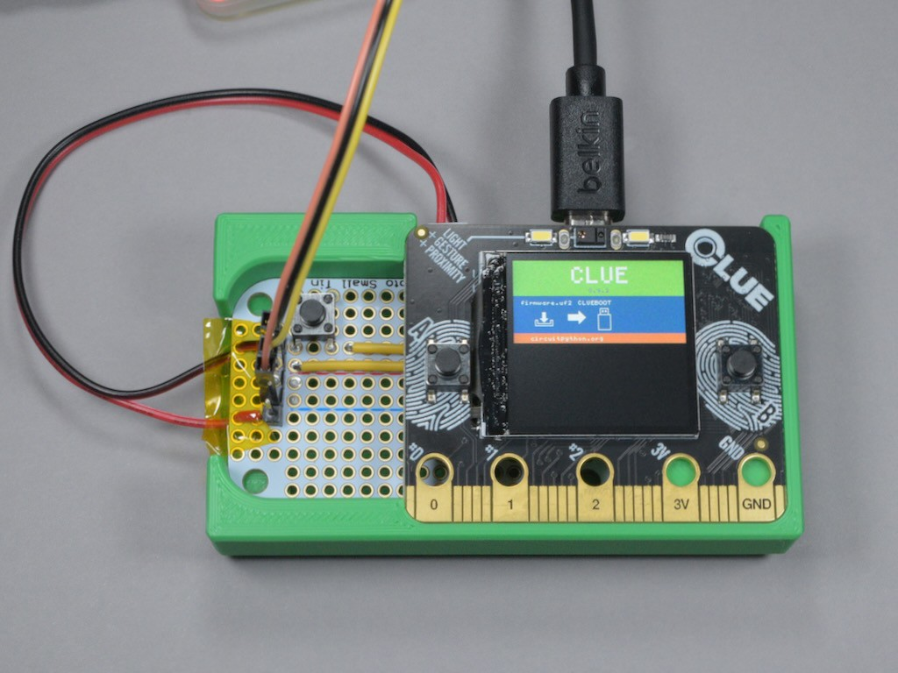

# clue-swd-pogo-jig

This is a 3D model for a press fit base that holds a perma-proto board with
pogo pins against the SWD test points on an Adafruit CLUE board. My Playground
guide, [Zephyr Quest: SWD Pogo Adapter for CLUE](https://adafruit-playground.com/u/SamBlenny/pages/zephyr-quest-swd-pogo-adapter-for-clue),
explains more details.


## Parts

- Adafruit Perma-Proto Small Mint Tin Size Breadboard PCB ([\#1214](https://www.adafruit.com/product/1214))
- Adafruit CLUE ([\#4500](https://www.adafruit.com/product/4500))
- [Adam Tech PH1-3B-02-MVS-5375](https://www.digikey.com/en/products/detail/adam-tech/PH1-3B-02-MVS-5375/9831904)
  2-position through hole pogo pins
- 0.1" header pins, Kapton tape
- [Raspberry Pi Debug Probe](https://www.adafruit.com/product/5699) (or some
  other SWD probe)


## Assembly Photos

1. Fully assembled

   

   Note that the reset button shown here doesn't actually work. I mis-aligned
   the pogo pin for the reset test point by just enough that it doesn't make
   contact. That doesn't matter because OpenOCD resets the board over SWD as
   part of programming the flash.

2. Perma-proto installed in base

   

3. Pogo pin closeup

   

4. Bottom of perma-proto

   

5. Top of perma-proto

   

6. 3D printed base

   


## Example of flashing CLUE bootloader

This uses OpenOCD and a Pi Debug Probe to program the the Adafruit CLUE
bootloader into the CLUE's nRF52840 flash over SWD. You might not need this
very often, but the point is it's an easy demo to verify the adapter and
openocd are working. If you do end up with a bricked bootloader, this method
stands a good chance of fixing it.

```
$ wget wget https://github.com/adafruit/Adafruit_nRF52_Bootloader/releases/download/0.9.2/clue_nrf52840_bootloader-0.9.2_s140_6.1.1.hex
$ openocd -f interface/cmsis-dap.cfg -f target/nrf52.cfg \
 -c "adapter speed 5000" -c init -c targets -c "reset halt" \
 -c "program clue_nrf52840_bootloader-0.9.2_s140_6.1.1.hex verify reset exit" \
 -c shutdown
Open On-Chip Debugger 0.12.0+dev-gcf9c0b41c (2025-02-09-09:00)
Licensed under GNU GPL v2
For bug reports, read
	http://openocd.org/doc/doxygen/bugs.html
Info : auto-selecting first available session transport "swd". To override use 'transport select <transport>'.
adapter speed: 5000 kHz
Info : Using CMSIS-DAPv2 interface with VID:PID=0x2e8a:0x000c, serial=E6625888175D0D2C
Info : CMSIS-DAP: SWD supported
Info : CMSIS-DAP: Atomic commands supported
Info : CMSIS-DAP: Test domain timer supported
Info : CMSIS-DAP: FW Version = 2.0.0
Info : CMSIS-DAP: Interface Initialised (SWD)
Info : SWCLK/TCK = 0 SWDIO/TMS = 0 TDI = 0 TDO = 0 nTRST = 0 nRESET = 0
Info : CMSIS-DAP: Interface ready
Info : clock speed 5000 kHz
Info : SWD DPIDR 0x2ba01477
Info : [nrf52.cpu] Cortex-M4 r0p1 processor detected
Info : [nrf52.cpu] target has 6 breakpoints, 4 watchpoints
Info : [nrf52.cpu] Examination succeed
Info : starting gdb server for nrf52.cpu on 3333
Info : Listening on port 3333 for gdb connections
    TargetName         Type       Endian TapName            State
--  ------------------ ---------- ------ ------------------ ------------
 0* nrf52.cpu          cortex_m   little nrf52.cpu          unknown
[nrf52.cpu] halted due to breakpoint, current mode: Thread
xPSR: 0x01000000 pc: 0x00000a80 msp: 0x20000400
[nrf52.cpu] halted due to breakpoint, current mode: Thread
xPSR: 0x01000000 pc: 0x00000a80 msp: 0x20000400
** Programming Started **
Info : nRF52840-QI/CAAA(build code: D0) 1024kB Flash, 256kB RAM
Info : Padding image section 0 at 0x00000b00 with 1280 bytes
Info : Flash write discontinued at 0x00025de8, next section at 0x000f4000
Warn : Adding extra erase range, 0x00025de8 .. 0x00025fff
Info : Padding image section 2 at 0x000fc6b8 with 4424 bytes
Warn : Adding extra erase range, 0x000fd858 .. 0x000fdfff
Warn : Adding extra erase range, 0x10001000 .. 0x10001013
Warn : Adding extra erase range, 0x1000101c .. 0x10001fff
** Programming Finished **
** Verify Started **
** Verified OK **
** Resetting Target **
shutdown command invoked
$
```

For me, the end result looked like this:



After that, to get CircuitPython working, I installed the UF2 file from the
Circuitpython.org CLUE download page using the normal method, and it worked.
The un-bricking was a success.
