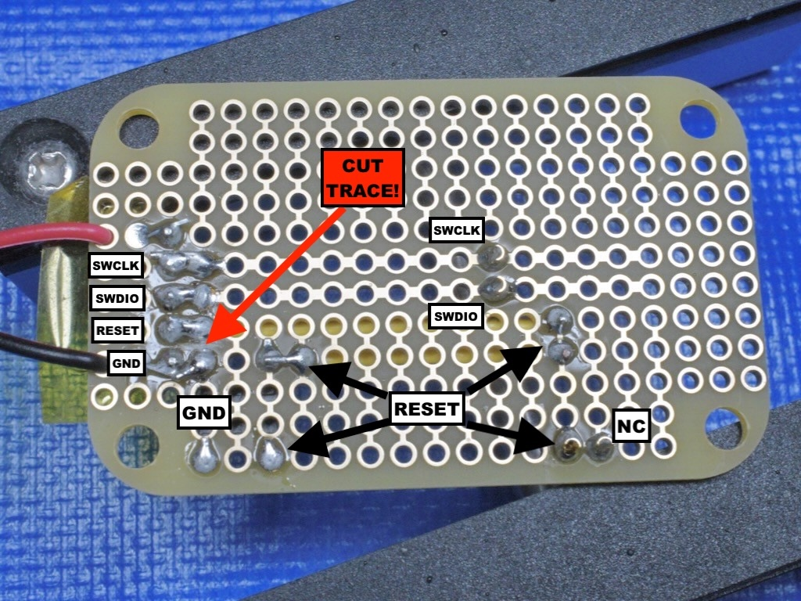
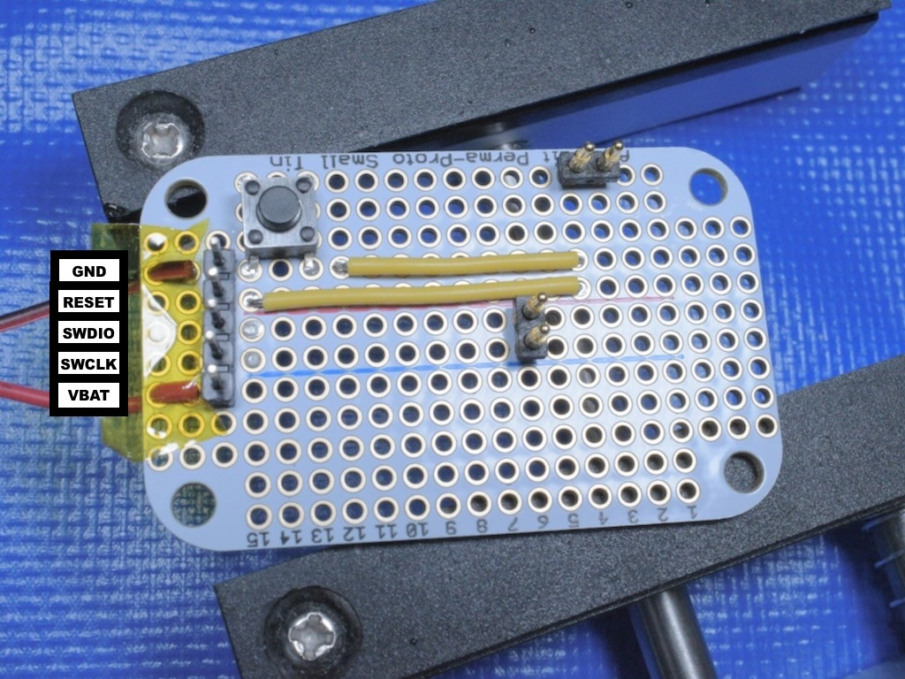
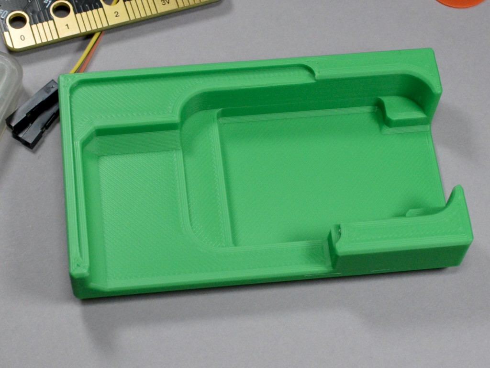
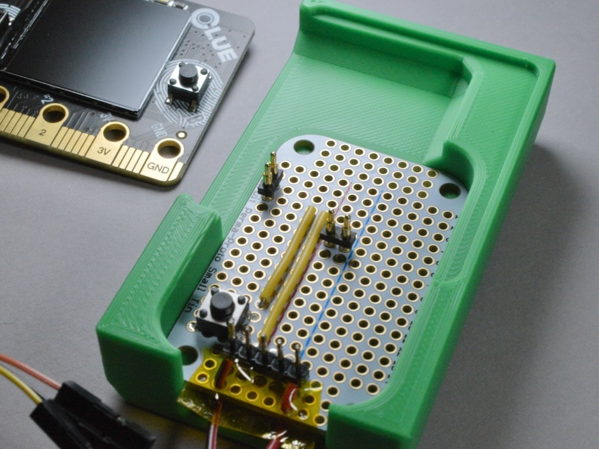
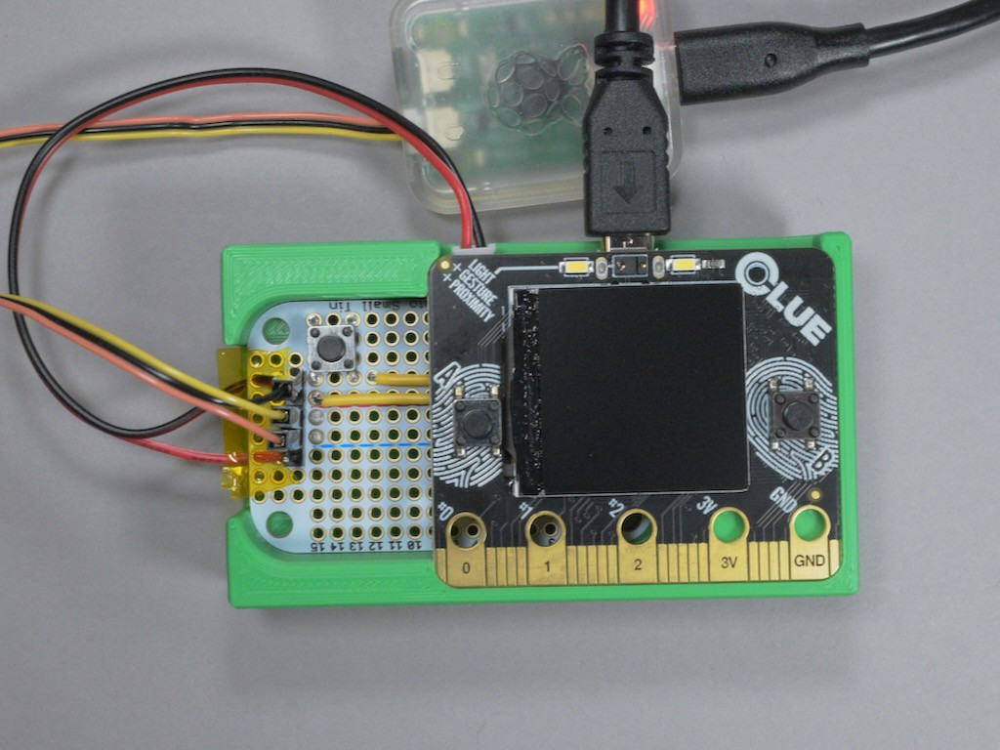
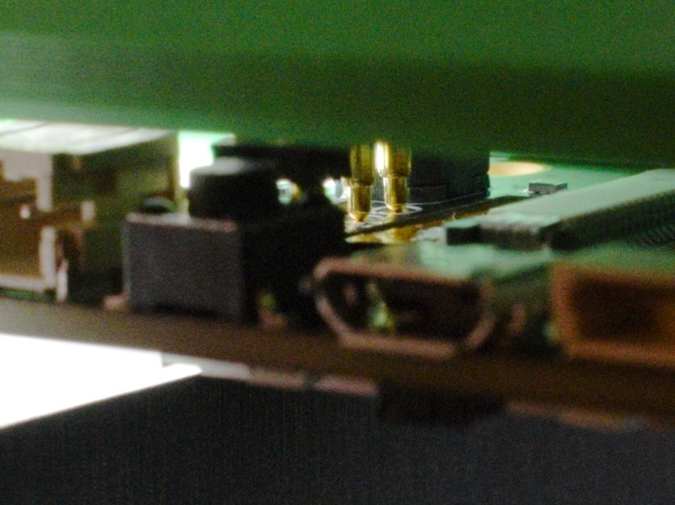

# clue-swd-pogo-jig

This is a 3D model for a press fit base that holds a perma-proto board with
pogo pins against the SWD test points on an Adafruit CLUE board. My Playground
guide, [Zephyr Quest: SWD Pogo Adapter for CLUE](https://adafruit-playground.com/u/SamBlenny/pages/zephyr-quest-swd-pogo-adapter-for-clue),
explains more details.

## Parts

- Adafruit Perma-Proto Small Mint Tin Size Breadboard PCB ([\#1214](https://www.adafruit.com/product/1214))
- Adafruit CLUE ([\#4500](https://www.adafruit.com/product/4500))
- [Adam Tech PH1-3B-02-MVS-5375](https://www.digikey.com/en/products/detail/adam-tech/PH1-3B-02-MVS-5375/9831904)
  2-position through hole pogo pins
- Hookup wire, 0.1" header pins, Kapton tape
- [Raspberry Pi Debug Probe](https://www.adafruit.com/product/5699) (or some
  other SWD probe)

## Assembly Photos

1. Bottom of perma-proto

   

2. Top of perma-proto

   

3. 3D printed base

   

4. Perma-proto installed in base

   

5. Fully assembled

   

6. Pogo pin closeup

   
